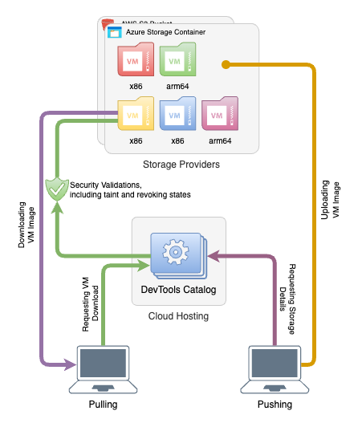

# Parallels Desktop Catalog Manifest Service

## Description

The Catalog Manifest is an open source implementation of storing and distributing
Parallels Desktop virtual machines in a standardized format. This contains some
security concept and allows for a quick ans secure way of distributing virtual
machines either in the corporate world where you want to distribute a standard
set of virtual machines to your employees or in the open source world where you
want to distribute a virtual machine to your users.

## Architecture

The Catalog Manifest is a service that is written in Go and it is a very light
height service that can be deployed in a container or on a virtual machine. It
uses rest API to execute the necessary steps. It also has RBAC (Role Based
Access Control) to allow for a secure way of distributing virtual machines. We
also use the concept of **Taint** and **Revoke** to allow for a secure way of
distributing virtual machines.
This will make the management of a global catalog of virtual machines very easy
and secure and in s centralized way.



## Concepts

## Catalog Manifest Metadata

The Catalog Manifest Metadata is a json file that contains the metadata of the
virtual machine. It contains all the necessary information to recreate the machine
in the same state as it existed previously. It will also contain the information
on where it will be stored using the selected
[Storage Provider](#storage-providers). The Service does not store any parts of
the Virtual Machine, all this is passed to the storage provider making it a light
height approach to distributing the API.

## Storage Providers

This is where all of the big files will be stored, the service can have multiple
manifests that store machines in different storage providers, for example you
might have a manifest that stores the machine in the `aws s3 bucket` and another
one that is stored in `azure blob storage` . This allows for a very flexible way
of storing the virtual machines.
Once a user/service tries to pull a machine, the service will check the manifest
and see where the machine is stored and then it will pull it from the storage provider.

At the moment we support the following storage providers:

* [AWS S3](https://aws.amazon.com/s3/)
* [Azure Blob Storage](https://azure.microsoft.com/en-us/services/storage/blobs/)
* [Jfrog Artifactory](https://jfrog.com/artifactory/)

### Connection String

Each storage provider will require different variables to be able to access it
and this will be represented in the connection string starting by indicating
what is the provider.

#### AWS S3

```bash
provider=aws-s3;bucket=<bucket-name>;region=<bucket-region>;access_key=<access_key>;secret_key=<access_secret>
```

#### Azure Blob Storage

```bash
provider=azure-storage-account;storage_account_name=<storage-account-name>;container_name=<storage-account-container>;storage_account_key=<storage-account-key>
```

#### Jfrog Artifactory

```bash
provider=artifactory;url=<artifactory_url_without_artifact>;repo=<repo_name>;access_key=<api_access_key>
```

## Catalog Manifest and Versions

Each Catalog Manifest has an ID and a version, the ID is a unique identifier for
the manifest and the version is the version of the manifest. The version is used
to track the changes in the manifest and it is used to track the changes in the
virtual machines. Each time a virtual machine is updated, you need to define a
new version, while you can use version semantics to define the version this is a
free field and they work in a similar way to the tags in docker.

Each version is by itself a full version of the virtual machine, this means that
if you want to update a virtual machine, you need to create a new version of the
virtual machine and then update the manifest to point to the new version.

## Taint

Taint is the ability to mark a version of a virtual machine as tainted, this
means that the virtual machine is not usable anymore and it should not be used.
This is useful when you want to deprecate a version of a virtual machine, you
can mark it as tainted and then the service will not allow users to pull this
version of the virtual machine. Or temporarily taint it due to security
concerns. It will help admins to manage large number of deployment by making
sure no one is using a tainted version of a virtual machine. Taint is not
definitive, you can untaint a version of a virtual machine and it will be usable
again.

## Revoke

Revoke is the ability to revoke a version of a virtual machine, this means that
the virtual machine is not usable anymore and it should not be used. This is
useful when you want to deprecate a version of a virtual machine, you can revoke
it and then the service will not allow users to pull this version of the virtual
machine. This is a definitive action and once a version is revoked it cannot be
used again. This is useful when you want to revoke a version of a virtual machine
due to security concerns.

## RBAC

Each Catalog Manifest has the ability to define a required Claim or Role that
the user must have to be able to see it. This allows for a very granular way of
managing the access to the virtual machines. This is useful when you want to
distribute a virtual machine to a specific group of users. For example you might
want to distribute a virtual machine to your developers and another one to your
designers. You can create two manifests and then define the required claim for
each one of them. This will allow you to have a very granular way of managing
the access to the virtual machines.

## Importing a Virtual Machine

We allow the import of a specific metadata file that contains the information
about the virtual machine. This will allow you to import a virtual machine that
was not created using the service. This is useful when you want to import a
virtual machine that was created using another tool or manually. This will allow
you to have a centralized way of managing all of your virtual machines.

## Push

Push is the ability to push a virtual machine to the service, this will allow
you to push a virtual machine to the catalog manifest service. The client that
is pushing is the responsible part to first push the files to the requested
storage container and then push the metadata to the service. This will allow
for a very flexible way of pushing the virtual machines to the service and not
requiring heavy lifting from the service itself.

### Pushing a Virtual Machine Diagram


## Pull

Pull is the ability to pull a virtual machine from the service, this will allow
you to pull a virtual machine from the catalog manifest service. The client that
is pulling will follow these steps:

* calls the remote catalog service provided in the connection string
* checks for the metadata of the virtual machine and where it is stored
* pulls the virtual machine from the storage provider
* creates the virtual machine using the metadata
* starts the virtual machine

This will allow for once again the heavy lifting to be done by the client and
not the service itself. Also allows for the secure connection between the client
and the storage provider.

### Pulling a Virtual Machine Diagram


## Caching

A Virtual Machine can be a very big file and pulling it every time you want to
use it can be very time consuming. To solve this problem we have implemented a
caching mechanism that will allow you to cache the virtual machine locally and
then use it from the cache. The client will check if the content checksum
matches the one in the cache and if so it will use the one in the cache. This
will allow for a very fast way of pulling the virtual machine.

## Usage

This feature is bundled with Parallels Desktop RestAPI and it can be used by
ether using command-line or the rest API endpoints

## Command-line

With the command-line we can either pass flags with the parameters we want to
use or we can use the `pdfile` configuration file. The configuration file
resembles the *dockerfile* and uses the same approach to define the parameters

for example, for pushing a virtual machine to the service we can create a file
with this content:

```bash
FROM example.com
INSECURE true

AUTHENTICATE USERNAME root
AUTHENTICATE PASSWORD someverylongpassword

CATALOG_ID test-catalog
VERSION 1.0
ARCHITECTURE arm64
LOCAL_PATH /Users/foobar/Parallels/macOS_Github_actions_runner.macvm
ROLE Admin
ROLE User
CLAIM UPDATE_CATALOG

PROVIDER NAME aws-s3
PROVIDER BUCKET catalog-example
PROVIDER REGION us-east-2
PROVIDER ACCESS_KEY SOMEACCESSKEY
PROVIDER SECRET_KEY SOMESECRETKEY
```

Then you can run the command:

```bash
pd-api-service catalog push --file=./example.pdfile 
```

for pulling it will be a very similar process:

```bash
FROM example.com
INSECURE true

AUTHENTICATE USERNAME root
AUTHENTICATE PASSWORD someverylongpassword

CATALOG_ID test_push_1
VERSION v1
ARCHITECTURE arm64

MACHINE_NAME test_pull_1
OWNER foobar
DESTINATION /Users/foobar/Parallels
START_AFTER_PULL false
```

Then you can run the command:

```bash
pd-api-service catalog pull --file=./example.pdfile 
```

## Rest API

### Push a new Catalog Manifest

#### [POST] /api/v1/catalog/push

```json
{
    "catalog_id": "",
    "version": "",
    "connection": "",
    "local_path": "",
    "required_roles": [],
    "required_claims": []
}
```

Where:

* `catalog_id` is the name of the catalog ID you want to push, this should not
  contain spaces, for example test-catalog
* `version` is the version of the catalog you want to push, this can be any
* `connection` is the connection string to the storage provider, this can be
  different depending on the provider
* `local_path` is the path where the virtual machine is stored locally
* `required_roles` is the list of roles that are required to be able to pull
  this virtual machine
* `required_claims` is the list of claims that are required to be able to pull

### Pull a Catalog Manifest

```json
{
    "catalog_id": "",
    "version": "",
    "machine_name": "",
    "owner": "",
    "connection": "host=<user>:<password>@localhost",
    "path": "",
    "start_after_pull": true
}
```

Where:

* `catalog_id` is the name of the catalog ID you want to pull, this should not
  contain spaces, for example test-catalog
* `version` is the version of the catalog you want to pull, this can be any
* `machine_name` is the name of the virtual machine, this is the name that will
  be used in Parallels Desktop
* `owner` is the owner of the virtual machine, this is the owner that will be
* `connection` is the connection string to the Parallels Desktop API Service
* `path` is the path where the virtual machine will be stored locally
* `start_after_pull` is a boolean that will indicate if the virtual machine
  should be started after pulling it

## Import a Catalog Manifest

```json
{
    "catalog_id": "",
    "version": "",
    "connection": ""
}
```

Where:

* `catalog_id` is the name of the catalog ID you want to import, this should not
  contain spaces, for example test-catalog
* `version` is the version of the catalog you want to import, this can be any
* `connection` is the connection string to the storage provider, this can be
  different depending on the provider
