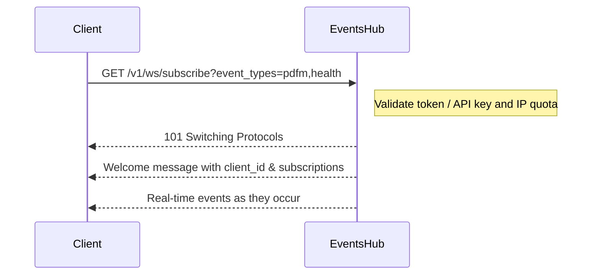

# Events Hub User Guide

The Events Hub delivers real-time updates about your Parallels Desktop infrastructure so DevOps and SRE teams can act the moment something changes. Use it to monitor host health, follow orchestrator workflows, or watch VM lifecycle events without resorting to heavy polling.

## 1. Why listen to events?
- See host, orchestrator, and VM activity the instant it happens
- Power dashboards and alerting pipelines with live data instead of cron jobs
- Reduce MTTR by spotting failures before users report them
- Keep stakeholders informed during incident bridges via global announcements

## 2. Concepts & vocabulary
- **Events Hub**: the managed WebSocket endpoint exposed by the DevOps Service.
- **Event channel**: a category of events you can subscribe to (for example `pdfm` for VM lifecycle updates).
- **Subscription**: the list of event channels attached to your WebSocket session. `global` is always included.
- **Client ID**: the unique identifier returned after you connect; required for unsubscribe calls.
- **Welcome message**: the first payload delivered after a successful handshake confirming your active channels.

| Channel | What it covers | Typical users | Auto-included |
|---------|----------------|---------------|---------------|
| `global` | Platform-wide announcements, planned maintenance, shutdown notices | Everyone | Yes (cannot be removed) |
| `pdfm` | VM lifecycle actions occurring on managed hosts | VM ops teams, CI pipelines | On request |
| `system` | Host-level state changes and client utilities (client ID lookup) | Host admins, automation frameworks | On request |
| `orchestrator` | Infrastructure workflows, catalog operations, orchestration tasks | Platform engineers, release managers | On request |
| `health` | Heartbeat ping events used to verify connectivity | On-call engineers, monitoring bots | On request |

## 3. Before you start
- **Authentication**: supply either a Bearer token or an API key that includes at least the read-only claim.
- **Connection policy**: only one active WebSocket connection is permitted per public IP address. Plan shared environments (NAT, jump hosts) accordingly.
- **TLS & proxies**: terminate TLS at the Events Hub or your edge. Preserve `X-Forwarded-For` so IP enforcement works correctly.
- **Tooling**: you can experiment with the bundled Postman collection (`docs/Parallels_Desktop_API.postman_collection.json`), `websocat`/`wscat`, or language SDKs such as Node.js `ws`, Python `websockets`, or Go `gorilla/websocket`.
- **Subscription changes**: unsubscribing is done via REST. To add new channels you must close the socket and reconnect with the desired `event_types` query string.

## 4. Connection flow at a glance


A typical welcome payload looks like:

```json
{
  "id": "evt-2025-12-05T10:15:30Z",
  "event_type": "global",
  "timestamp": "2025-12-05T10:15:30Z",
  "message": "WebSocket connection established subscribed to global by default",
  "body": {
    "client_id": "b6928d12-c836-4efc-98f1-3220db691900",
    "subscriptions": ["pdfm", "global", "health"]
  }
}
```

## 5. Quick start walkthrough
1. **Collect credentials**: obtain a token or API key with read access.
2. **Pick event channels**: decide which domains you need (for example `pdfm,health`).
3. **Open the socket**:
   ```bash
   websocat "wss://your-devops-host/v1/ws/subscribe?event_types=pdfm,health" \
     -H "Authorization: Bearer <TOKEN>"
   ```
4. **Verify the handshake**: you should receive HTTP `101 Switching Protocols` plus the welcome JSON.
5. **Watch events stream in**: VM operations, orchestrator steps, or health pings arrive as they happen.
6. **Optionally test Postman**: import `docs/Parallels_Desktop_API.postman_collection.json`, then run the "Events Hub" folder to exercise subscribe/unsubscribe calls.

### Language snippets

#### Node.js (`ws`)
```javascript
import WebSocket from 'ws';

const token = process.env.DEVOPS_TOKEN;
const host = process.env.DEVOPS_HOST; // e.g., https://devops.example.com

const ws = new WebSocket(
  `${host}/v1/ws/subscribe?event_types=pdfm,health`,
  { headers: { Authorization: `Bearer ${token}` } }
);

ws.on('open', () => console.log('Connected to Events Hub'));

ws.on('message', (raw) => {
  const event = JSON.parse(raw.toString());
  console.log('Event received:', event);

  if (event.event_type === 'health' && event.message === 'ping') {
    ws.send(
      JSON.stringify({ type: 'health', message: 'ping', id: `ping-${Date.now()}` })
    );
  }
});

ws.on('close', () => console.log('Connection closed'));
ws.on('error', (err) => console.error('WebSocket error:', err));
```

#### Python (`websockets`)
```python
import asyncio
import json
import os

import websockets

TOKEN = os.environ["DEVOPS_TOKEN"]
HOST = os.environ["DEVOPS_HOST"]  # e.g., "https://devops.example.com"
EVENT_TYPES = "pdfm,health"


async def main():
  uri = f"{HOST}/v1/ws/subscribe?event_types={EVENT_TYPES}"
  headers = {"Authorization": f"Bearer {TOKEN}"}

  async with websockets.connect(uri, extra_headers=headers) as ws:
    print("Connected to Events Hub")

    async for raw in ws:
      event = json.loads(raw)
      print("Event received:", event)

      if event.get("event_type") == "health" and event.get("message") == "ping":
        await ws.send(json.dumps({
          "type": "health",
          "message": "ping",
          "id": f"ping-{asyncio.get_event_loop().time()}"
        }))


asyncio.run(main())
```

#### Go (`gorilla/websocket`)
```go
package main

import (
  "encoding/json"
  "log"
  "net/http"
  "net/url"
  "os"
  "time"

  "github.com/gorilla/websocket"
)

type Event struct {
  EventType string                 `json:"event_type"`
  Message   string                 `json:"message"`
  Body      map[string]interface{} `json:"body"`
}

func main() {
  token := os.Getenv("DEVOPS_TOKEN")
  host := os.Getenv("DEVOPS_HOST") // e.g., https://devops.example.com
  eventTypes := "pdfm,health"

  u, _ := url.Parse(host)
  u.Path = "/v1/ws/subscribe"
  query := u.Query()
  query.Set("event_types", eventTypes)
  u.RawQuery = query.Encode()

  header := http.Header{
    "Authorization": []string{"Bearer " + token},
  }

  conn, _, err := websocket.DefaultDialer.Dial(u.String(), header)
  if err != nil {
    log.Fatalf("dial error: %v", err)
  }
  defer conn.Close()

  log.Println("Connected to Events Hub")

  for {
    _, data, err := conn.ReadMessage()
    if err != nil {
      log.Fatalf("read error: %v", err)
    }

    var event Event
    if err := json.Unmarshal(data, &event); err != nil {
      log.Printf("unmarshal error: %v", err)
      continue
    }

    log.Printf("Event received: %+v", event)

    if event.EventType == "health" && event.Message == "ping" {
      payload := map[string]interface{}{
        "type":    "health",
        "message": "ping",
        "id":      "ping-" + time.Now().Format(time.RFC3339Nano),
      }
      message, _ := json.Marshal(payload)
      if err := conn.WriteMessage(websocket.TextMessage, message); err != nil {
        log.Printf("write error: %v", err)
      }
    }
  }
}
```

## 6. Choosing the right event channels
- Combine channels to match your workflow. Example: `global + orchestrator` during release nights, or `pdfm + health` when mirroring VM rollouts.
- Filter client-side on `event_type`, `message`, or fields inside `body` to drive automation.
- Expect JSON payloads that contain a unique event `id`, a descriptive `message`, and domain-specific data in `body` (for example VM IDs, host identifiers, state transitions).

## 7. Staying connected & sending commands
- **Heartbeats**: once you subscribe to `health`, it is your client’s responsibility to initiate periodic ping messages and verify the `pong` replies from the Events Hub.
- **Client commands**: only two client-to-server messages are currently supported.

Client ID lookup (requires subscription to `system`):

```json
{
  "type": "system",
  "message": "client-id",
  "id": "request-123"
}
```

Response:

```json
{
  "event_type": "system",
  "message": "client-id",
  "ref_id": "request-123",
  "client_id": "b6928d12-c836-4efc-98f1-3220db691900",
  "body": {"client-id": "b6928d12-c836-4efc-98f1-3220db691900"}
}
```

Health ping (requires subscription to `health`):

```json
{
  "type": "health",
  "message": "ping",
  "id": "ping-001"
}
```

Response:

```json
{
  "event_type": "health",
  "message": "pong",
  "ref_id": "ping-001",
  "client_id": "b6928d12-c836-4efc-98f1-3220db691900"
}
```

- **Connection ownership**: if the Events Hub stops receiving pong responses your connection is treated as dead and will be closed.

## 8. Updating subscriptions via REST
Use the REST endpoint when you need to unsubscribe from certain channels without tearing down the socket immediately.

`POST /v1/ws/unsubscribe`

```bash
curl -X POST "https://your-devops-host/v1/ws/unsubscribe" \
  -H "Authorization: Bearer <TOKEN>" \
  -H "Content-Type: application/json" \
  -d '{
    "client_id": "b6928d12-c836-4efc-98f1-3220db691900",
    "event_types": ["pdfm"]
  }'
```

**Rules to remember**
- You cannot remove `global` from the subscription list.
- The client ID must belong to the authenticated user.
- Successful removal returns HTTP `200` and lists the channels removed. If the request mixes valid and invalid types you receive partial success plus guidance in the response.
- To add new channels later, close the socket and reconnect with the new `event_types` list.

## 9. Troubleshooting playbook
- **`409 Conflict` on connect** — another session is already active from your IP. Close the existing connection or connect from a different address.
- **No events arrive** — either the `event_types` list is wrong or the token lacks read access. Double-check both.
- **Health pings stop** — your client is not sending `ping` or acknowledging `pong`. Ensure you subscribed to `health` and respond on time.
- **Unsubscribe fails** — the request includes `global` or the client ID does not belong to the caller. Remove `global` and confirm ownership.
- **Invalid event type error** — there is a typo or unsupported channel name. Refer back to the channel table in Concepts & vocabulary.

## 10. Operational guardrails & security hygiene
- One active connection per IP address; coordinate team usage behind NAT or deploy a relay service.
- Rotate tokens/API keys regularly and scope them to the minimum claims required.
- Use TLS end-to-end where possible. If terminating upstream, forward the original IP via `X-Forwarded-For`.
- Monitor idle clients and close unused sessions from your side to stay within limits.
- During planned maintenance, broadcast via `global` so connected clients can react gracefully.

## 11. Real-time use cases
- **Host reliability dashboards**: subscribe to `system` and `health` to stream host state into Grafana, triggering automation when a host degrades.
- **VM lifecycle governance**: listen to `pdfm` during deployments to reconcile desired vs actual VM inventory and roll back quickly on failure.
- **Orchestrator workflow tracing**: use the `orchestrator` channel to follow catalog, CI/CD, or provisioning jobs step by step.
- **Incident war rooms**: mix `global` with domain-specific channels to give responders full situational awareness.
- Integrate with alerting platforms (PagerDuty, Slack, MS Teams) or runbooks that expect structured JSON events.
- Validate real-time visibility in staging by simulating host failures and ensuring the Events Hub relays them instantly.

## 12. Reference corner
- **Endpoints**
  - `GET /v1/ws/subscribe`: Upgrades to WebSocket. Query parameter `event_types` accepts a comma-separated list (`pdfm,system,health`). Missing or invalid types default to `global` only.
  - `POST /v1/ws/unsubscribe`: Removes one or more event channels from the active session.
- **Welcome message schema**
  - `id`: unique event identifier
  - `event_type`: always `global` for the welcome event
  - `message`: descriptive text
  - `body.client_id`: your connection ID
  - `body.subscriptions`: array of active channels (always includes `global`)
- **Event payload tips**
  - Use `timestamp` for ordering; all values are UTC ISO-8601.
  - `client_id` in the event body indicates a targeted message, otherwise it is a broadcast.

### FAQ
- **How do I add a new channel after connecting?** Close the socket and reconnect with the updated `event_types` list.
- **Can multiple applications share one connection?** No. Connections are tied to a single client ID and IP. Create separate connections per consumer.
- **What if my IP changes?** The new IP can open a connection as long as no other session is active from that address.
- **Can I disable heartbeats?** No. Heartbeats ensure both sides know the connection is healthy.
- **Do you expose metrics for the Events Hub?** Not yet. Use your client-side telemetry for monitoring.

## 13. Resources & next steps
- Import and expand the Postman collection at `docs/Parallels_Desktop_API.postman_collection.json` to include your environment URLs.
- Review example scripts in your automation repos or build new ones using the snippets provided above.
- Prepare a rollout checklist: issue credentials, update firewall rules, test reconnect backoff, and document alerting integrations.
- After onboarding, periodically test the unsubscribe endpoint and reconnect logic to ensure they still align with organizational policies.
