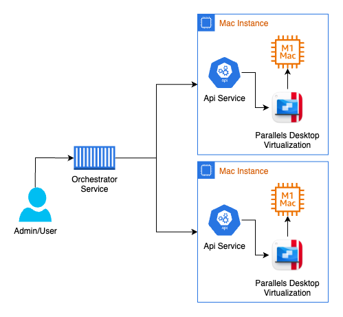

# Parallels Desktop Orchestrator Service

The Parallels Desktop Orchestrator Service is a service that can run in a container or directly in a host and will allow you to orchestrate and manage multiple Parallels Desktop Api Services. This will allow in a simple way to have a single pane of glass to manage multiple Parallels Desktop Api Services and check their status.
You will also be able to create virtual machines automatically and let the orchestrator choose the host with enough free resources

## Architecture

The Parallels Desktop Orchestrator Service is written in go and uses the same base code as the Parallels Desktop Api Service. One single executable that depending on how you run it it will behave in a different way, this allows for a simpler way for deploying it.
The service itself has a simple architecture where it will have a collection of hosts, these hosts are connectors to a Parallels Desktop API instance, the orchestrator then will start by having a background service that keeps an eye on the status of each host and records any changes that it sees, like for example the available resources, it's health state and the virtual machines that are running on it.
You can then manage each host individually by creating, starting, stopping and deleting virtual machines or you can let the orchestrator do it for you by creating a virtual machine and letting the orchestrator choose the host with enough resources to run it.

